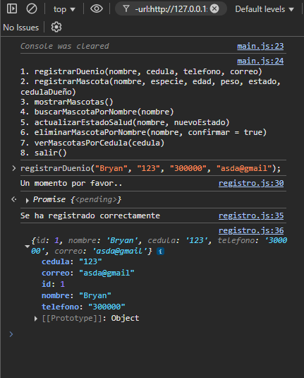
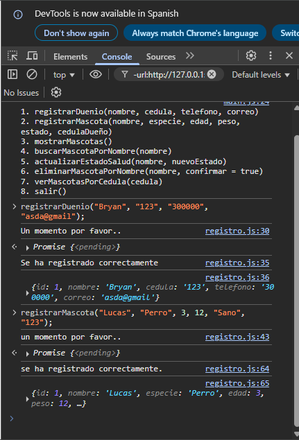
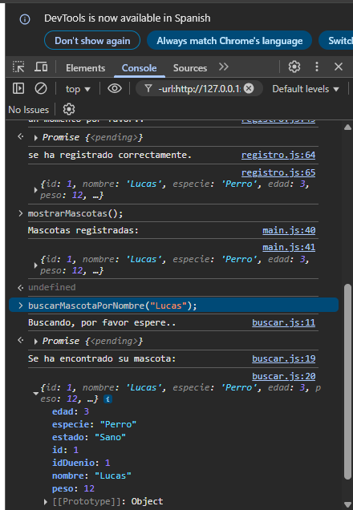

# Proyecto veterinaria

Este proyecto consiste en una aplicación de consola hecha en JavaScript puro para gestionar mascotas y sus dueños dentro de una veterinaria, aplicando asincronía y buenas prácticas de programación modular.

---

## Descripción del Proyecto

El sistema permite registrar dueños y mascotas, buscar, listar, actualizar y eliminar mascotas desde la consola del navegador. El proyecto fue desarrollado sin frameworks ni librerías externas, utilizando JavaScript moderno (ES6+) y ejecutado completamente en el navegador.

Se ha implementado una estructura modular con archivos separados y uso de `import` / `export`, para una mayor claridad, reutilización y escalabilidad del código.

---

## Tecnologías Usadas

- JavaScript (ES6+)
- HTML5
- Módulos ES (`import` / `export`)
- Consola del navegador (DevTools)

---

## Aplicación de Asincronía

Se utilizaron distintas técnicas de asincronía para simular procesos del mundo real en una veterinaria:

| Funcionalidad                            | Técnica aplicada             |     Retraso simulado    |
|----------------------------------------- |---------------------------   |-------------------------|
| Registrar dueño                          | `setTimeout` + `async/await` | 1.5 segundos            |
| Registrar mascota                        | `setTimeout` + `async/await` | 2 segundos              |
| Buscar mascota por nombre                | Promesa (`Promise`)          | 1.5 segundos            |
| Actualizar estado de salud               | `async/await` + delay        | 1 segundo               |
| Eliminar mascota                         | Promesa + confirmación       | 2 segundos              |
| Ver mascotas de un dueño por cédula      | `async/await` + delay        | 2 segundos              |

---

La asincronía se aplicó en el proyecto para simular procesos reales que tomarían tiempo en una veterinaria, como validar información, esperar la revisión del veterinario. Se utilizaron diversas técnicas nativas de JavaScript:

**setTimeout:** para simular tiempos de espera artificiales (por ejemplo, validación de datos o eliminación).

**Promise:** para estructurar búsquedas con posibles fallos y manejar respuestas exitosas o errores de forma controlada.

**async/await:** para simplificar el manejo de funciones asincrónicas, como actualizar el estado de salud de una mascota o cargar mascotas asociadas a un dueño.

Cada una de las funciones principales del sistema implementa alguna de estas técnicas.

## Cómo Usar

Para visualizarlo por consola, debe abrirse desde Visual Studio y visualizarse con la extension LiverServer ya que al abrirse directamente desde un navegador lo bloquea por seguridad.

## Ejemplo de uso por consola

Se debe llamar las funciones tal cual como están escritas y llenar sus datos.
Los únicos valores de tipo numerico son al registrar una mascota cuando pide la edad y peso.
Los demás valores son tipo String, es decir, se debe registrar mediante comillas, sean simples o sencillas. Por ejemplo:

```js
registrarDuenio("Bryan", "123", "3101234567", "bryan@mail.com");
registrarMascota("Lucas", "Perro", 2, 8, "Sano", "123");
buscarMascotaPorNombre("Lucas");

## Imagenes

 
 
 

## Video

 


## Autor

-  Bryan Villabona
    
-  [GitHub]([BryanVillabona](https://github.com/BryanVillabona))


